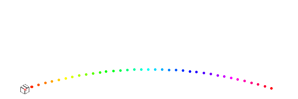

# 🎨 Icon Path Animator

Een flexibel Python-script dat automatisch vloeiende **GIF-animaties** genereert. Het script laat een icoontje over een (stippel)lijn bewegen, in een rechte lijn of in een boogje. Ideaal voor het visualiseren van data-stromen, netwerkverkeer of laad-animaties.



## ✨ Kenmerken

* **Vormkeuze:** Kies tussen een rechte lijn (`STRAIGHT`) of een boog (`ARC`).
* **Richting:** Ondersteunt Links-naar-Rechts (LTR) en Rechts-naar-Links (RTL).
* **Automatisering:** Spiegelt automatisch het icoontje bij RTL-beweging.
* **Stijlen:** Regenboogkleuren 🌈 of een vaste lijnkleur.
* **Transparantie:** Ondersteunt transparante achtergronden (RGBA), dus makkelijk overal te gebruiken.

## 🛠️ Installatie

Zorg dat je [Python 3](https://www.python.org/) geïnstalleerd hebt.

1.  Clone deze repository of download de bestanden.
2.  Installeer de benodigde dependencies via `requirements.txt`:

```bash
pip install -r requirements.txt
```

Note: Dit script maakt voornamelijk gebruik van de Pillow (PIL) library voor beeldverwerking.

## ⚙️ Configuratie
Open het Python-script en pas de instellingen bovenaan het bestand aan onder het kopje `=== CONFIGURATIE ===`.

**Belangrijkste instellingen**

|Variabele|	Opties|	Omschrijving|
|---------|-------|-------------|
|`PATH_SHAPE` | `"ARC"` / `"STRAIGHT"` | Bepaalt of de lijn recht is of een boogje maakt.|
|`DIRECTION` | `"LTR"` / `"RTL"` | De richting van de animatie (Links/Rechts).|
| `USE_RAINBOW_LINE` | `True / False` |	Zet aan voor een regenboog-stippellijn. |
| `DURATION_SECONDS` | Getal (bijv. `30`) |De totale lengte van de animatie in seconden. |
| `PACKET_INTERVAL` |Getal (bijv. `3`) |Hoe vaak een nieuw icoontje verschijnt. |
| `ICON_FILENAME` |Pad naar bestand | De bron-afbeelding (bijv. media/drawing.png). |

**Bestandsstructuur**
Zorg dat de mappenstructuur er ongeveer zo uitziet

```text
📂 project-map/
├── 📄 main.py           # Het Python script
├── 📄 requirements.txt  # Dependencies
└── 📂 media/
    ├── 🖼️ drawing.png   # Je input icoontje (bronbestand)
    └── 📂 output/       # Hier komt de GIF terecht
```

## 🚀 Gebruik
Start het script simpelweg via de terminal:

```bash
python main.py
```

Het script zal de voortgang printen in de terminal:

`Genereren van 450 frames. Vorm: ARC, Richting: RTL... Klaar! Bestand opgeslagen als: media/output/drawing-animatie.gif`

## 📝 Requirements
De inhoud van je `requirements.txt` is minimaal:

```bash
Pillow
```

Gemaakt met Python en Pillow.